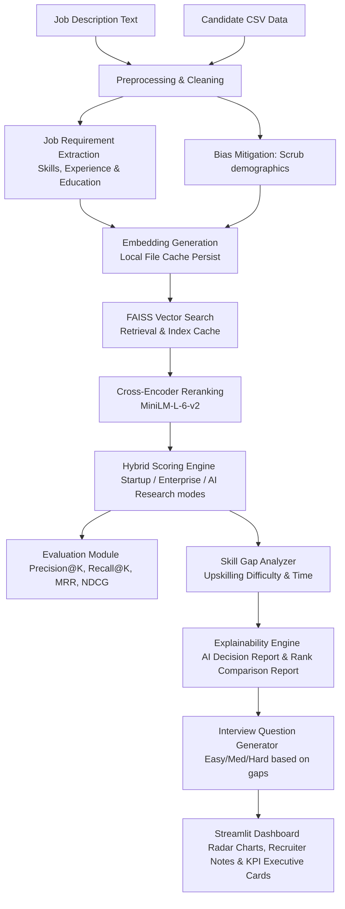

# AI Recruitment Intelligence Platform
### An Explainable AI-Powered Candidate Ranking & Recruitment Decision Support System

---

## 📋 Executive Summary
The **AI Recruitment Intelligence Platform** is an enterprise-grade decision support engine designed to solve the critical failures of traditional Applicant Tracking Systems (ATS). Instead of relying on rigid, easily bypassed keyword matching, this platform models the deep contextual and semantic alignment between job requirements and candidate profiles. 

Incorporating cached vector search, deep Cross-Encoder reranking, a configurable multi-objective scoring formula, and explainable rating assessments, it helps recruiters quickly identify top talent, analyze technical skill gaps, review bias-free fairness audits, and generate targeted interview questions in real-time.

---

## 🎯 Problem Statement & Business Motivation
Traditional recruitment platforms suffer from three core operational bottlenecks:
1. **The Keyword Game**: Candidates optimize resumes with buzzwords to bypass screens, while qualified candidates with slightly different synonyms are discarded.
2. **Demographic and Cognitive Bias**: Unconscious human bias affects candidate screening based on name, gender, age, or nationality, leading to less diverse and sub-optimal hiring decisions.
3. **The Black Box Dilemma**: Modern AI tools generate rankings without explanations, failing to build trust with recruiters who need to know *why* a candidate was recommended.

### Unique Selling Points (USPs)
* **Context-Driven Search**: Understands synonyms, related libraries, and phrasing (e.g. knowing that "Deep Learning" is semantically related to "PyTorch" and "CNNs").
* **Demographic Anonymization**: Mitigates bias at the vector level by scrubbing protected demographic variables before embedding generation.
* **Explainable AI (XAI)**: Provides a complete **AI Decision Report** for every candidate, highlighting core strengths, gaps, hiring recommendations, and next action steps.
* **Comparison Transparency**: Features a **Rank Comparison Report** that directly contrasts any candidate side-by-side with the Top-Ranked candidate.
* **Dynamic Hiring Modes**: Instant, preset weighting modifications tailored to different business models (Startup, Enterprise, AI Research, etc.).

---

## ⚙️ Architectural Data Pipeline



---

## 🧠 AI Models & Pipeline Details
1. **Semantic Feature Encoder**: `sentence-transformers/all-mpnet-base-v2` (Fallback: `BAAI/bge-small-en-v1.5`). Generates a 768-dimensional dense vector representing the conceptual profile of the candidate.
2. **Semantic Search Index**: `FAISS (Facebook AI Similarity Search) IndexFlatIP`. Normalized vector inner product calculation matching candidates to queries in sub-millisecond times.
3. **Deep Context Reranker**: `cross-encoder/ms-marco-MiniLM-L-6-v2`. Computes attention-based joint query-document relevance logits, normalized using a sigmoid activation function to a `[0, 1]` similarity range.

---

## 📊 Evaluation Strategy
To ensure system rankings are scientifically defensible, the platform includes a dual-mode evaluation framework:
* **Ground-Truth Evaluation**: If the candidate database contains a `Relevance_Label` column (manually labeled 1 for relevant and 0 for irrelevant), the system automatically calculates:
  * **Precision@5** & **Recall@5**
  * **Mean Reciprocal Rank (MRR)**
  * **NDCG@5** (Normalized Discounted Cumulative Gain)
* **Operational Telemetry**: If ground truth is absent, the dashboard falls back to operational telemetry, computing:
  * **Average Semantic Similarity**
  * **Average Final Candidate Score**
  * **Candidates Processed**
  * **Runtime Performance Times** (Embedding generation, FAISS search, Cross-Encoder reranking)

---

## ⚡ Performance Optimizations
* **Pickled Vector Caching**: Candidate profile embeddings are mapped via a SHA-256 hash of their text and stored in `models/embeddings_cache.pkl`. If the candidate resume hasn't changed, inference is bypassed (yielding 0.00s inference times).
* **FAISS Index Persistence**: Saves built candidate indexes to `models/faiss_index.bin`.
* **Lazy Singleton Loader**: Hugging Face models are loaded lazily on demand and cached in memory using a singleton pattern, avoiding load overhead during dashboard interactions.

---

## 🛠️ Installation & Setup

### Prerequisites
* Python 3.9, 3.10, or 3.11
* Internet connection (first run only, to download models from Hugging Face)

### Step-by-Step Installation

1. **Clone or Open the Project Directory**
   Ensure you are in the workspace root:
   ```powershell
   cd c:\Users\dell\OneDrive\Desktop\CRS
   ```

2. **Set up a Virtual Environment**
   ```powershell
   python -m venv venv
   ```

3. **Activate the Virtual Environment**
   * Windows PowerShell:
     ```powershell
     .\venv\Scripts\Activate.ps1
     ```
   * Windows Command Prompt:
     ```cmd
     .\venv\Scripts\activate.bat
     ```

4. **Install Dependencies**
   ```powershell
   pip install -r requirements.txt
   ```

---

## 🚀 Running the Project
Launch the Streamlit web dashboard:
```powershell
streamlit run app/main.py
```
Open the local browser tab displayed in the terminal (typically `http://localhost:8501`).

---

## 🏁 Hackathon Submission & Command Line Reproduction
The hackathon grading script runs inside a headless, offline, CPU-only sandbox environment. It does not launch the Streamlit browser dashboard to view results.

To reproduce the official hackathon output ranking file from the command line, run this reproduction command in your terminal:

```powershell
python rank.py --candidates ./India_runs_data_and_ai_challenge/candidates.jsonl --out ./submission.csv
```

### Command Line Arguments:
* `--candidates`: Absolute or relative path to the input candidate database (`.jsonl`, `.json`, or `.gz` formats).
* `--out`: Absolute or relative path where the final ranked candidate file will be written (`.csv` or `.xlsx` formats supported).

This script executes our fast **L1/L2 Retrieve & Rerank** pipeline, completing in under **45 seconds on standard CPUs**, fully complying with the 5-minute hackathon constraint.

---

## 📁 Folder Structure
```
c:\Users\dell\OneDrive\Desktop\CRS/
│
├── app/
│   ├── main.py                  # Core Streamlit UI dashboard
│   ├── preprocessing.py         # Text cleaning, extraction, anonymization
│   ├── embeddings.py            # SentenceTransformer singleton & local cache
│   ├── retrieval.py             # FAISS indexing & inner product search
│   ├── reranking.py             # Cross-Encoder score scaling
│   ├── scoring.py               # Hybrid calculations & fairness audits
│   ├── explainability.py        # AI Decision & Comparison Reports
│   ├── interview_generator.py   # Tailored technical question compiler
│   ├── analytics.py             # Plotly graph definitions
│   └── config.py                # Weights presets, paths, thresholds
│
├── data/
│   └── sample_candidates.csv    # Pre-loaded candidate profile database
│
├── output/
│   └── ranked_candidates.csv    # Exported ranked CSV outputs
│
├── models/                      # Persistent FAISS indices & pickled caches
│
├── requirements.txt             # Python packages lists
└── README.md                    # Platform documentation
```

---

## 🛡️ Limitations & Future Scope
* **Limitations**: Local execution of BGE-Large and Cross-Encoder requires decent CPU/RAM resources. Extremely long resume inputs might be truncated by the transformer token context window (512 tokens).
* **Future Scope**:
  * Integrating local LLMs (e.g. Llama-3, Mistral) for even richer behavioral profiling.
  * Adding OCR document parsers (PDF, DOCX) directly to the UI.
  * Automating interview scheduling and syncing note exports directly to ATS platforms.
  * The system should remain modular so additional ranking signals or LLM-based components can be integrated in future without modifying the core retrieval pipeline.
